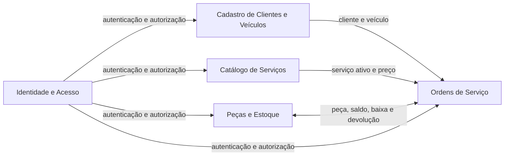
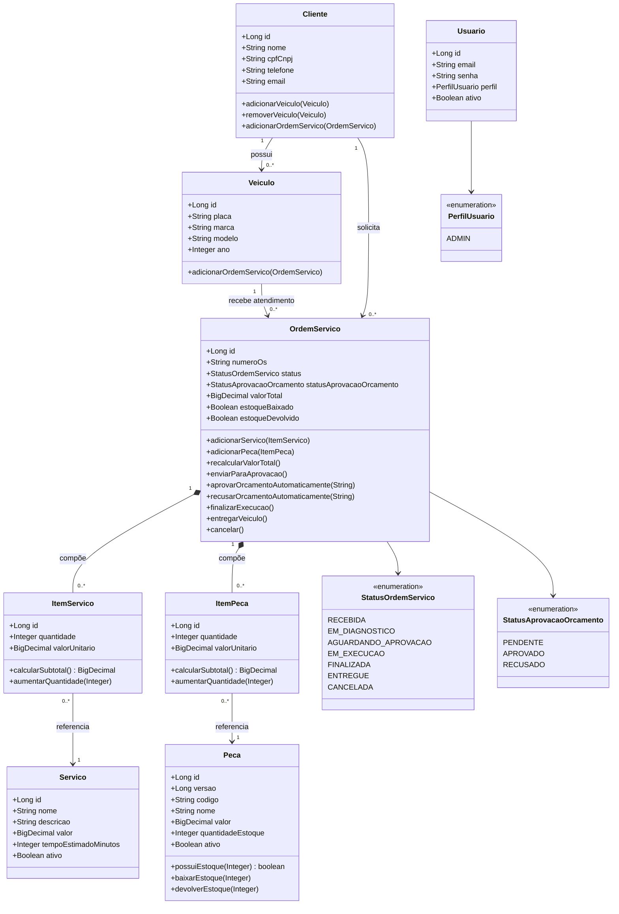
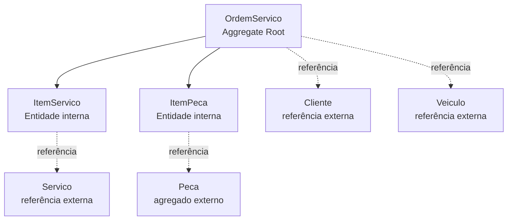
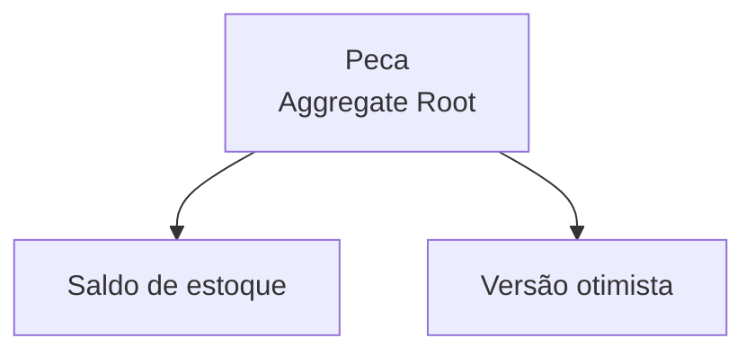
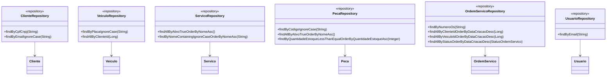
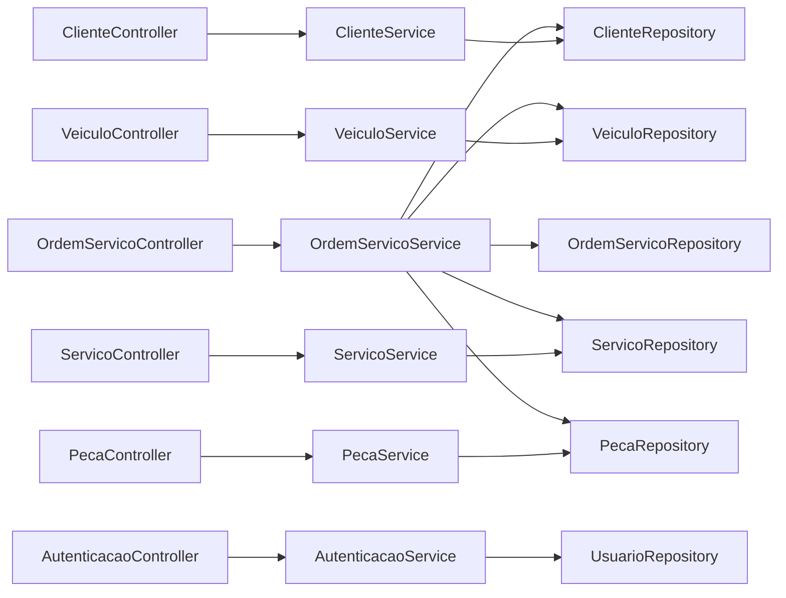
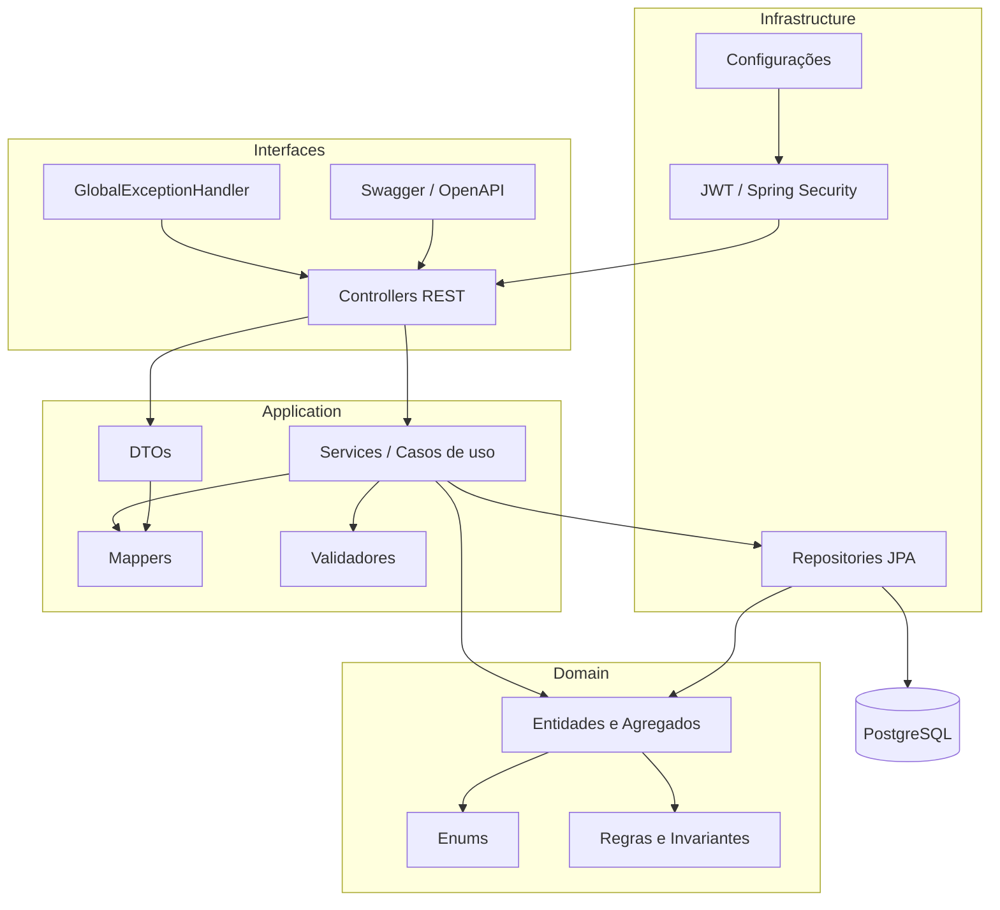
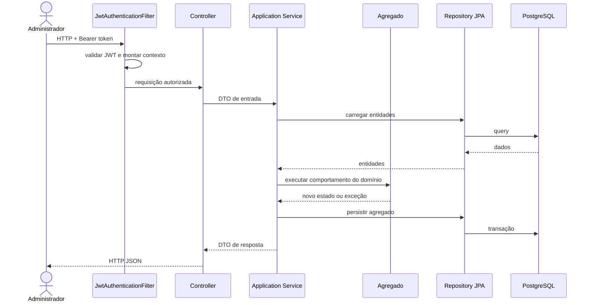
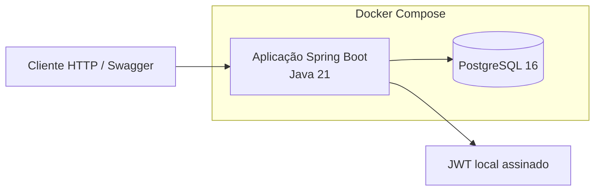

# Diagramas DDD e Arquitetura

Este documento apresenta uma leitura arquitetural do projeto `tech-challenge-oficina`. Os diagramas representam o código atual; elementos descritos como futuros não devem ser interpretados como já implementados.

## Visão estratégica

O sistema está implantado como um monólito modular em camadas. Os contextos abaixo são limites funcionais dentro da mesma aplicação e do mesmo banco de dados, não microserviços independentes.

### Contextos funcionais

| Contexto | Responsabilidade | Elementos principais |
|---|---|---|
| Clientes e Veículos | Identificar proprietários e seus veículos | Cliente, Veículo |
| Catálogo de Serviços | Manter serviços disponíveis e preços | Serviço |
| Peças e Estoque | Manter catálogo, saldo e movimentações | Peça |
| Ordens de Serviço | Orquestrar diagnóstico, orçamento, aprovação e execução | OrdemServico, ItemServico, ItemPeca |
| Identidade e Acesso | Autenticar administrador e proteger endpoints | Usuario, PerfilUsuario, JWT |

O contexto de Ordens de Serviço é o núcleo principal. Ele consome dados dos contextos de suporte e coordena a baixa ou devolução de peças.

## Modelo de domínio

## Agregados

### Agregado Ordem de Serviço

Responsabilidades da raiz:

- Proteger transições de status.
- Validar cliente e veículo.
- Controlar inclusão, incremento e remoção de itens.
- Calcular o orçamento.
- Controlar aprovação e recusa.
- Coordenar baixa e devolução de estoque.
- Registrar datas do ciclo de vida.

`ItemServico` e `ItemPeca` não são manipulados diretamente pela API fora da OS.

### Agregado Peça

Protege o saldo contra quantidades inválidas e estoque negativo. A versão otimista detecta atualizações concorrentes.

### Agregados de cadastro

- **Cliente**: raiz do cadastro do proprietário; mantém a associação com seus veículos.
- **Veículo**: possui identidade própria e participa da OS por referência.
- **Serviço**: item independente do catálogo.
- **Usuário**: identidade administrativa para autenticação.

Cliente e Veículo possuem relacionamento bidirecional no modelo JPA, mas a criação e manutenção são realizadas por serviços de aplicação próprios.

## Value Objects

O projeto atual não possui classes dedicadas de Value Object.

Conceitos com potencial para se tornarem Value Objects:

| Conceito atual | Possível Value Object | Benefício |
|---|---|---|
| `String cpfCnpj` | `Documento` | Centralizar normalização e validação |
| `String placa` | `Placa` | Garantir formato válido na construção |
| `String email` | `Email` | Normalização e invariantes |
| `BigDecimal valor` | `Dinheiro` | Escala, moeda e operações financeiras |
| `String numeroOs` | `NumeroOrdemServico` | Geração, formato e identidade pública |

Esses Value Objects são sugestões de evolução e não existem no código atual.

## Repositories

As interfaces estendem Spring Data JPA e ficam na camada `infrastructure/repository` do projeto atual.

## Serviços de aplicação

| Serviço | Papel |
|---|---|
| `ClienteService` | CRUD, normalização, unicidade e proteção de exclusão |
| `VeiculoService` | CRUD, normalização de placa e vínculo com cliente |
| `ServicoService` | CRUD e ativação do catálogo de serviços |
| `PecaService` | CRUD, ativação e movimentação manual de estoque |
| `OrdemServicoService` | Caso de uso central, transações, consultas e mapeamento do fluxo da OS |
| `AutenticacaoService` | Validação de credenciais e emissão de JWT |

Os serviços de aplicação orquestram repositories, mappers e agregados. Regras centrais de transição e cálculo permanecem em `OrdemServico` e `Peca`.

## Arquitetura em camadas

### Responsabilidades

| Camada | Pode conhecer | Não deve concentrar |
|---|---|---|
| Interfaces | Application e contratos HTTP | Regras de negócio e acesso direto ao banco |
| Application | Domain, repositories, DTOs e mappers | Detalhes HTTP |
| Domain | Seus próprios conceitos | Controllers, JSON, JWT ou queries de infraestrutura |
| Infrastructure | Domain e detalhes técnicos | Decisões do fluxo de negócio |

Observação: as entidades usam anotações JPA, portanto o domínio atual possui dependência técnica de persistência. É uma escolha pragmática deste projeto em camadas, não uma implementação de domínio completamente isolado.

## Fluxo de uma requisição administrativa

## Dependências externas e implantação

O sistema não depende atualmente de mensageria, cache distribuído, serviço externo de identidade ou API de terceiros.

## Decisões e limitações atuais

- Monólito modular com banco único.
- Contextos funcionais não são módulos Java independentes.
- Eventos de negócio são documentais, não mensagens publicadas.
- Não há Value Objects dedicados.
- Não há entidade Mecânico, Fornecedor ou Insumo.
- Repositories Spring Data ficam em `infrastructure`, embora sejam interfaces usadas pela aplicação.
- Entidades do domínio possuem anotações JPA.
- `OrdemServicoService` coordena múltiplos agregados em transações locais.
