# Event Storming — Ordem de Serviço

Este documento modela o fluxo da Ordem de Serviço (OS) usando a notação conceitual de Event Storming. Os eventos representam fatos relevantes do negócio; o sistema atual os processa de forma síncrona no agregado e não publica mensagens em um broker.

## Legenda

| Elemento | Significado |
|---|---|
| **Ator** | Pessoa ou papel que inicia uma ação. |
| **Comando** | Intenção de alterar o estado do sistema. |
| **Evento** | Fato de negócio ocorrido, escrito no passado. |
| **Política** | Regra que reage a uma condição e determina outra ação. |
| **Agregado** | Limite responsável por proteger as regras de consistência. |
| **Read model** | Informação consultada sem alterar o domínio. |
| **Hotspot** | Decisão, risco ou ponto que merece discussão futura. |

## Visão geral

```mermaid
flowchart LR
    A1[Administrador] --> C1[Criar Ordem de Serviço]
    C1 --> E1[Ordem de Serviço Criada]
    E1 --> C2[Adicionar Serviços e Peças]
    C2 --> E2[Diagnóstico Iniciado]
    E2 --> E3[Orçamento Recalculado]
    E3 --> C3[Enviar Orçamento para Aprovação]
    C3 --> E4[Orçamento Enviado para Aprovação]

    E4 --> A2[Cliente]
    A2 --> C4[Aprovar Orçamento]
    A2 --> C5[Recusar Orçamento]

    C4 --> P1{Estoque suficiente?}
    P1 -- Não --> H1[Execução Impedida]
    P1 -- Sim --> E5[Orçamento Aprovado]
    E5 --> E6[Estoque Baixado]
    E6 --> E7[Execução Iniciada]

    C5 --> E8[Orçamento Recusado]
    E8 --> E2

    E7 --> C6[Finalizar Execução]
    C6 --> E9[Ordem de Serviço Finalizada]
    E9 --> C7[Entregar Veículo]
    C7 --> E10[Veículo Entregue]

    E1 -. antes do encerramento .-> C8[Cancelar Ordem de Serviço]
    E2 -. antes do encerramento .-> C8
    E4 -. antes do encerramento .-> C8
    E7 -. antes do encerramento .-> C8
    C8 --> P2{Estoque foi baixado?}
    P2 -- Não --> E11[Ordem de Serviço Cancelada]
    P2 -- Sim --> E12[Estoque Devolvido]
    E12 --> E11
```



## Linha do tempo principal

### 1. Recebimento e criação

| Tipo | Elemento |
|---|---|
| Ator | Administrador |
| Comando | **Criar Ordem de Serviço** |
| Dados necessários | Cliente, veículo, observações e pelo menos um serviço |
| Agregado | Ordem de Serviço |
| Evento | **Ordem de Serviço Criada** |
| Estado resultante | `RECEBIDA`, avançando para `EM_DIAGNOSTICO` ao incluir itens |

Políticas e invariantes:

- Cliente e veículo devem existir.
- O veículo deve pertencer ao cliente informado.
- Serviços e peças incluídos devem estar ativos.
- Quantidades devem ser positivas.
- O Número da OS é gerado e deve ser único.
- O valor unitário dos itens é capturado no momento da inclusão.

### 2. Diagnóstico e composição do orçamento

| Tipo | Elemento |
|---|---|
| Ator | Administrador |
| Comandos | **Adicionar Serviço**, **Adicionar Peça**, **Remover Peça**, **Recalcular Orçamento** |
| Agregado | Ordem de Serviço |
| Eventos | **Diagnóstico Iniciado**, **Serviço Adicionado à OS**, **Peça Adicionada à OS**, **Peça Removida da OS**, **Orçamento Recalculado** |
| Estado | `EM_DIAGNOSTICO` |

Políticas:

- Itens iguais são incrementados em vez de criarem duplicidade lógica.
- O total é a soma dos subtotais de serviços e peças.
- A alteração é permitida somente em `RECEBIDA` ou `EM_DIAGNOSTICO`.
- Alterações não movimentam estoque antes da aprovação.

### 3. Envio para aprovação

| Tipo | Elemento |
|---|---|
| Ator | Administrador |
| Comando | **Enviar Orçamento para Aprovação** |
| Agregado | Ordem de Serviço |
| Evento | **Orçamento Enviado para Aprovação** |
| Estado resultante | `AGUARDANDO_APROVACAO` e aprovação `PENDENTE` |

Políticas:

- O orçamento deve possuir pelo menos um serviço.
- O valor total deve ser maior que zero.
- Os itens ficam bloqueados enquanto a decisão estiver pendente.
- A data de envio é registrada.

### 4A. Aprovação e início da execução

| Tipo | Elemento |
|---|---|
| Ator de negócio | Cliente |
| Operador da API atual | Administrador |
| Comando | **Aprovar Orçamento** |
| Agregados envolvidos | Ordem de Serviço e Peça |
| Eventos | **Orçamento Aprovado**, **Estoque Baixado**, **Execução Iniciada** |
| Estado resultante | `EM_EXECUCAO` e aprovação `APROVADO` |

Política automática:

```text
QUANDO Orçamento Aprovado
SE todas as peças possuem estoque suficiente
ENTÃO Baixar Estoque uma única vez
E Iniciar Execução
SENÃO impedir a aprovação e manter a OS aguardando aprovação
```

Regras transacionais:

- As quantidades da mesma peça são consolidadas antes da validação.
- Todas as peças são validadas antes de qualquer baixa.
- Estoque insuficiente impede toda a operação.
- `estoqueBaixado` evita dupla baixa.
- `dataBaixaEstoque`, `dataAprovacao` e `dataInicioExecucao` são registradas.

### 4B. Recusa e revisão

| Tipo | Elemento |
|---|---|
| Ator de negócio | Cliente |
| Operador da API atual | Administrador |
| Comando | **Recusar Orçamento** |
| Agregado | Ordem de Serviço |
| Evento | **Orçamento Recusado** |
| Estado resultante | `EM_DIAGNOSTICO` e aprovação `RECUSADO` |

Políticas:

- A recusa exige observação.
- A OS volta ao diagnóstico para permitir revisão.
- Após alterar os itens, o orçamento pode ser reenviado.
- Recusa não encerra nem cancela a OS.

### 5. Execução e finalização

| Tipo | Elemento |
|---|---|
| Ator | Administrador |
| Comando | **Finalizar Execução** |
| Agregado | Ordem de Serviço |
| Evento | **Ordem de Serviço Finalizada** |
| Estado resultante | `FINALIZADA` |

Políticas:

- Somente uma OS `EM_EXECUCAO` pode ser finalizada.
- A data de finalização é registrada.
- A duração é calculada entre início da execução e finalização.
- Finalização significa trabalho concluído, não veículo entregue.

### 6. Entrega

| Tipo | Elemento |
|---|---|
| Ator | Administrador |
| Comando | **Entregar Veículo** |
| Agregado | Ordem de Serviço |
| Evento | **Veículo Entregue** |
| Estado resultante | `ENTREGUE` |

Políticas:

- Somente uma OS `FINALIZADA` pode ser entregue.
- A data da entrega é registrada.
- `ENTREGUE` é um estado terminal.

## Caminho alternativo: cancelamento

| Tipo | Elemento |
|---|---|
| Ator | Administrador |
| Comando | **Cancelar Ordem de Serviço** |
| Agregados envolvidos | Ordem de Serviço e Peça, quando houver devolução |
| Eventos | **Estoque Devolvido**, quando aplicável; **Ordem de Serviço Cancelada** |
| Estado resultante | `CANCELADA` |

Política automática:

```text
QUANDO Cancelamento Solicitado
SE a OS ainda não está FINALIZADA, ENTREGUE ou CANCELADA
E o estoque foi baixado
E o estoque ainda não foi devolvido
ENTÃO Devolver Estoque
E Cancelar Ordem de Serviço
```

Se não houve baixa, a OS é cancelada sem movimentação. `estoqueDevolvido` impede devolução duplicada.

## Agregados e responsabilidades

### Ordem de Serviço — aggregate root

Protege:

- Associação entre cliente e veículo.
- Coleções de Item de Serviço e Item de Peça.
- Cálculo do orçamento.
- Estado da aprovação.
- Transições do ciclo de vida.
- Marcação de baixa e devolução de estoque.
- Datas do fluxo.

### Peça

Protege:

- Quantidade disponível.
- Estoque não negativo.
- Entrada, baixa e devolução.
- Concorrência por versão otimista.

### Cliente e Veículo

Fornecem a identidade do atendimento e garantem a relação de propriedade usada pela OS.

### Serviço

Fornece os dados de catálogo e o valor unitário capturado pelo Item de Serviço.

## Read models e consultas

| Consulta | Consumidor | Dados principais |
|---|---|---|
| OS por ID ou número | Administrador | Visão completa da OS |
| OS por cliente | Administrador | Histórico do cliente |
| OS por veículo | Administrador | Histórico do veículo |
| OS por status | Administrador | Fila operacional |
| Orçamento da OS | Administrador | Itens e totais |
| Duração da execução | Administrador | Início, fim e duração |
| Tempo médio de execução | Administrador | Indicador das OS finalizadas |
| Acompanhamento público | Cliente | Etapa e datas sem dados sensíveis |

## Exceções e resultados negativos

| Situação | Resultado de negócio |
|---|---|
| Veículo não pertence ao cliente | Criação da OS rejeitada |
| Serviço ou peça inativa | Inclusão rejeitada |
| Quantidade inválida | Inclusão rejeitada |
| Orçamento sem serviço | Envio rejeitado |
| Alteração durante aprovação ou execução | Alteração rejeitada |
| Estoque insuficiente | Aprovação e execução impedidas |
| Aprovação ou recusa repetida | Transição rejeitada |
| Recusa sem observação | Recusa rejeitada |
| Finalização fora da execução | Transição rejeitada |
| Entrega sem finalização | Transição rejeitada |
| Cancelamento de OS finalizada ou entregue | Cancelamento rejeitado |

## Hotspots e decisões futuras

- **Aprovação pelo cliente:** hoje a decisão é registrada por endpoint administrativo; futuramente pode existir autenticação ou link exclusivo do cliente.
- **Eventos reais:** os eventos são conceituais; uma evolução pode publicá-los para notificações, auditoria ou integrações.
- **Reserva de estoque:** o modelo atual baixa somente na aprovação. Uma reserva anterior exigiria novo conceito e regras de expiração.
- **Responsável técnico:** não há entidade Mecânico nem atribuição de profissional à OS.
- **Histórico de transições:** datas principais são armazenadas, mas não existe log imutável de todas as mudanças.
- **Migrações:** o schema usa `ddl-auto=update`; uma implantação produtiva deve adotar migrations versionadas.
