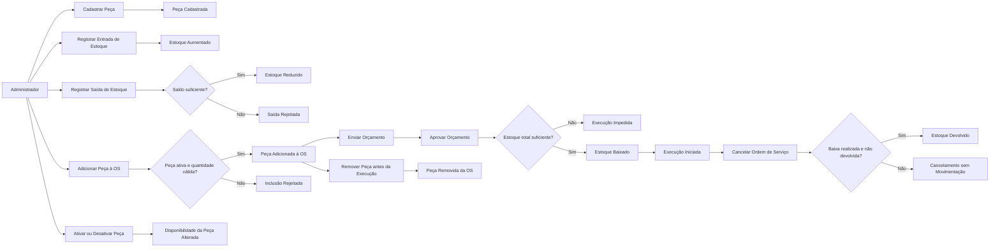

# Event Storming — Peças e Insumos

Este documento modela o ciclo de cadastro, movimentação e consumo de peças da oficina. No modelo atual, **Peça** é o único recurso físico controlado em estoque. Não existe uma entidade distinta chamada `Insumo`; portanto, materiais consumíveis que precisem de controle devem ser cadastrados como Peça ou tratados em uma evolução futura do domínio.

Os eventos abaixo são conceituais para análise do negócio. A aplicação atual executa as regras de forma síncrona e não publica eventos em mensageria.

## Legenda

| Elemento | Significado |
|---|---|
| **Ator** | Papel que solicita uma operação. |
| **Comando** | Intenção de alterar o estado. |
| **Evento** | Fato de negócio ocorrido. |
| **Política** | Regra que reage a uma condição. |
| **Agregado** | Limite de consistência das regras. |
| **Read model** | Informação consultada sem alteração. |
| **Hotspot** | Questão ainda aberta ou evolução possível. |

## Visão geral



## Conceitos do contexto

### Peça

Item de catálogo identificado por código único. Possui nome, descrição, valor, quantidade em estoque, indicador de atividade e versão otimista.

### Item de Peça

Representa o uso planejado de uma Peça dentro de uma Ordem de Serviço. Mantém quantidade e valor unitário capturado no momento da inclusão.

### Estoque

Saldo disponível da Peça. A quantidade nunca pode ser negativa.

### Insumo

Termo de negócio para material consumível. Não possui representação própria no código atual. Se precisar das mesmas regras de preço, quantidade e baixa, pode ser tratado como Peça. Caso exija unidade de medida, lote, validade ou consumo fracionado, demanda novo modelo.

## Fluxo 1 — Cadastro da peça

| Tipo | Elemento |
|---|---|
| Ator | Administrador |
| Comando | **Cadastrar Peça** |
| Agregado | Peça |
| Evento | **Peça Cadastrada** |

Dados:

- Código.
- Nome.
- Descrição.
- Valor unitário.
- Quantidade inicial.
- Indicador de atividade.

Regras:

- Código é obrigatório e único.
- Nome é obrigatório.
- Valor deve ser maior que zero.
- Quantidade inicial não pode ser negativa.
- A peça nasce ativa quando o indicador não é informado.

## Fluxo 2 — Entrada de estoque

| Tipo | Elemento |
|---|---|
| Ator | Administrador |
| Comando | **Registrar Entrada de Estoque** |
| Agregado | Peça |
| Evento | **Estoque Aumentado** |

Política:

```text
QUANDO uma entrada positiva é registrada
ENTÃO somar a quantidade ao saldo atual
```

A operação não está associada a fornecedor, nota fiscal, lote ou custo de aquisição no modelo atual.

## Fluxo 3 — Saída manual de estoque

| Tipo | Elemento |
|---|---|
| Ator | Administrador |
| Comando | **Registrar Saída de Estoque** |
| Agregado | Peça |
| Evento de sucesso | **Estoque Reduzido** |
| Resultado negativo | **Saída de Estoque Rejeitada** |

Política:

```text
QUANDO uma saída positiva é solicitada
SE o saldo for suficiente
ENTÃO reduzir a quantidade
SENÃO rejeitar a movimentação
```

## Fluxo 4 — Inclusão na Ordem de Serviço

| Tipo | Elemento |
|---|---|
| Ator | Administrador |
| Comando | **Adicionar Peça à OS** |
| Aggregate root | Ordem de Serviço |
| Entidade referenciada | Peça |
| Evento | **Peça Adicionada à OS** |

Políticas:

- A peça deve existir e estar ativa.
- A quantidade deve ser positiva.
- A OS deve permitir alteração de itens.
- Se a mesma peça já existir na OS, sua quantidade é incrementada.
- O valor unitário é copiado para o Item de Peça.
- A inclusão recalcula o orçamento.
- A inclusão ainda não baixa estoque.

### Alteração antes da execução

| Comando | Evento | Efeito no estoque |
|---|---|---|
| **Aumentar Quantidade da Peça** | **Quantidade da Peça na OS Aumentada** | Nenhum antes da aprovação |
| **Remover Peça da OS** | **Peça Removida da OS** | Nenhum antes da aprovação |
| **Recalcular Orçamento** | **Orçamento Recalculado** | Nenhum |

Itens não podem ser alterados quando a OS está aguardando aprovação, em execução, finalizada, entregue ou cancelada.

## Fluxo 5 — Baixa automática na aprovação

| Tipo | Elemento |
|---|---|
| Ator de negócio | Cliente aprova o orçamento |
| Operador atual | Administrador registra a aprovação |
| Comando | **Aprovar Orçamento** |
| Agregados envolvidos | Ordem de Serviço e Peça |
| Eventos | **Orçamento Aprovado**, **Estoque Baixado**, **Execução Iniciada** |

Política:

```text
QUANDO o orçamento é aprovado
ENTÃO consolidar as quantidades por identidade da Peça
E validar o estoque de todas as peças
SE todas possuem saldo suficiente
ENTÃO baixar todas as quantidades uma única vez
E iniciar a execução
SENÃO não baixar nenhuma peça
E manter a OS aguardando aprovação
```

Garantias:

- A validação ocorre antes da primeira baixa.
- Quantidades repetidas da mesma peça são somadas.
- Estoque nunca fica negativo.
- `estoqueBaixado` impede dupla baixa da OS.
- `dataBaixaEstoque` registra o momento da movimentação.
- `@Version` em Peça detecta atualizações concorrentes.

## Fluxo 6 — Estoque insuficiente

| Tipo | Elemento |
|---|---|
| Condição | Uma ou mais peças não possuem a quantidade total requerida |
| Resultado | **Aprovação Impedida por Estoque Insuficiente** |
| Estado da OS | Permanece `AGUARDANDO_APROVACAO` |
| Efeito | Nenhuma peça deve ter seu saldo alterado |

A resposta de negócio identifica a peça, a quantidade disponível e a necessária.

## Fluxo 7 — Devolução no cancelamento

| Tipo | Elemento |
|---|---|
| Ator | Administrador |
| Comando | **Cancelar Ordem de Serviço** |
| Condição | Estoque já baixado e ainda não devolvido |
| Eventos | **Estoque Devolvido**, **Ordem de Serviço Cancelada** |

Política:

```text
QUANDO uma OS é cancelada
SE o estoque foi baixado
E ainda não foi devolvido
ENTÃO devolver as quantidades consolidadas
E marcar a devolução
```

Garantias:

- Cancelamento anterior à execução não movimenta estoque.
- `estoqueDevolvido` impede devolução duplicada.
- `dataDevolucaoEstoque` registra a reposição.
- OS finalizada ou entregue não pode ser cancelada.

## Fluxo 8 — Ativação e desativação

| Comando | Evento | Consequência |
|---|---|---|
| **Ativar Peça** | **Peça Ativada** | Pode ser incluída em novas OS |
| **Desativar Peça** | **Peça Desativada** | Não pode ser incluída em novas OS |

Desativação não apaga a peça nem altera itens históricos já registrados.

## Agregados e consistência

### Peça

Responsável por:

- Código e identidade da peça.
- Estado ativo/inativo.
- Quantidade disponível.
- Validação de estoque suficiente.
- Baixa e devolução unitária.
- Controle otimista de concorrência.

### Ordem de Serviço — aggregate root do consumo

Responsável por:

- Itens de Peça necessários ao atendimento.
- Consolidação das quantidades.
- Momento permitido para alteração.
- Coordenação da baixa na aprovação.
- Marcação de baixa e devolução já realizadas.
- Devolução no cancelamento.

A consistência entre OS e Peça é protegida pela transação do serviço de aplicação.

## Read models e consultas

| Consulta | Objetivo |
|---|---|
| Listar todas as peças | Administração do catálogo |
| Listar peças ativas | Seleção para novas OS |
| Pesquisar por nome | Localização no catálogo |
| Buscar por código | Identificação operacional |
| Consultar peça por ID | Detalhes e saldo |
| Listar estoque baixo | Apoiar reposição com limite configurável |
| Consultar orçamento | Visualizar quantidades e valores planejados |
| Consultar OS | Confirmar itens, baixa e estado do fluxo |

## Resultados negativos

| Situação | Resultado |
|---|---|
| Código de peça duplicado | Cadastro rejeitado |
| Quantidade inicial negativa | Cadastro rejeitado |
| Entrada ou saída não positiva | Movimentação rejeitada |
| Saída maior que o saldo | Saída rejeitada |
| Peça inexistente ou inativa | Inclusão na OS rejeitada |
| Quantidade inválida no Item de Peça | Inclusão rejeitada |
| Alteração após envio/aprovação | Alteração rejeitada |
| Saldo insuficiente na aprovação | Execução impedida, sem baixa parcial |
| Segunda baixa da mesma OS | Operação rejeitada |
| Segunda devolução da mesma OS | Operação rejeitada |
| Conflito de atualização da Peça | Transação concorrente rejeitada |

## Hotspots e evoluções

- **Reserva:** não existe reserva de estoque antes da aprovação. Criá-la exigiria prazo, liberação e prevenção de reservas abandonadas.
- **Insumo separado:** avaliar entidade própria quando houver consumo fracionado, unidade de medida ou regras distintas de Peça.
- **Movimentação auditável:** hoje o saldo é atualizado diretamente; uma evolução pode registrar um livro de entradas, saídas, baixas e devoluções.
- **Fornecedor e compra:** não há fornecedor, pedido de compra, custo ou nota fiscal.
- **Lote e validade:** não existem rastreabilidade por lote, validade ou localização física.
- **Estoque mínimo por peça:** a consulta recebe um limite global; cada peça não possui ponto de reposição próprio.
- **Reserva concorrente:** a versão otimista detecta conflito, mas alta concorrência pode exigir uma estratégia adicional de retry ou bloqueio.
